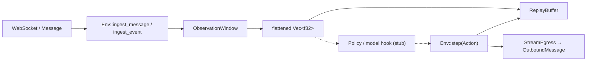

# RL training and inference toolchain analysis (WP-016)

**Status:** Accepted (analysis)  
**Date:** 2026-06-14  
**Scope:** `trolly-gym` — stream-fed RL for market-making / execution over `trolly-stream` ingress and `trolly-strategy` egress.

## Context

WP-011 landed a **feature-gated scaffold** (`torch` → optional `tch`/libtorch) with no training loop, checkpoint I/O, or production inference path. This document compares candidate ML stacks for **offline training** and **live inference** on the existing integration points, then records an explicit toolchain decision and follow-on work items.

### trolly-gym data flow (today)



| Integration point | Role today | ML touchpoint |
|-------------------|------------|---------------|
| [`Env::ingest_event`](../src/env.rs) | Filter by symbol, push features into window, prefill replay | Observation tensor construction; async ingest must not block on training |
| [`ObservationWindow`](../src/observation.rs) | Rolling frames (default 8 × 7 f32 = 56-d input stub) | Model input shape, normalization, device transfer |
| [`ReplayBuffer`](../src/replay.rs) | Ring buffer of `Transition { obs, action, reward, done }` | Off-policy sampling, batch export, checkpoint inputs |
| [`Action`](../src/action.rs) | Discrete Hold / Buy / Sell → `OutboundMessage` | Policy head (logits → argmax / sample), deterministic fallback |
| [`libtorch.rs`](../src/libtorch.rs) | `observation_tensor`, `stub_forward` (`torch` feature only) | Direct in-process forward pass |

### Stream constraints

- **Latency:** Depth and execution events arrive continuously; `ingest_event` runs on the stream hot path. Model **training** must not run inline with ingest.
- **Backpressure:** If inference in `step` exceeds inter-arrival time, the env falls behind live market state. Target **sub-ms to low-ms** forward pass on CPU for small MLPs; GPU optional for batch training only.
- **Determinism:** Production needs a **rule-based fallback** (e.g. `Action::Hold`) when the model is loading, ONNX session fails, or latency budget is exceeded.
- **Hot-swap:** Inference path should reload weights / ONNX session without restarting the stream multiplexer.

---

## Candidates evaluated

Summary matrix (training = offline/batch on replay; inference = live `Env::step` loop):

| Stack | Training | Live inference | GPU | CPU | External install | Default CI `cargo check --workspace` |
|-------|----------|----------------|-----|-----|------------------|----------------------------------------|
| **tch / libtorch** (`torch` feature) | Strong (manual loop or PyTorch parity) | Strong, in-process | CUDA via libtorch | Yes | **Heavy** — libtorch zip or `LIBTORCH_USE_PYTORCH=1` | **Pass** (optional dep, feature off) |
| **Candle** | Moderate — autograd + optimizers; immature RL libs | Strong, in-process | CUDA / Metal / ROCm (WIP) | MKL optional | Cargo features only | **Pass** if feature-gated optional |
| **Burn** | Strong — `burn-rl`, community PPO/DQN/SAC | Strong, in-process | WGPU / CUDA / LibTorch backend | NdArray backend | Mostly crates.io | **Pass** if feature-gated optional |
| **ONNX Runtime (`ort`)** | Weak — ORT training exists; not suited for custom RL loops | **Excellent** — deployment-focused | CUDA, TensorRT, EP plugins | Default EP | Prebuilt ORT via crate; EP feature flags | **Pass** if feature-gated optional |
| **Python / PyTorch sidecar (IPC)** | **Best** — SB3, CleanRL, Ray RLlib, custom | Moderate — IPC + (de)serialize latency | Full PyTorch | Yes | Python venv + sidecar process | **Pass** (out-of-process) |

---

### 1. tch / libtorch (`torch` feature — current)

**What it is:** Rust bindings to libtorch (same C++ backend as PyTorch). Already wired in [`libtorch.rs`](../src/libtorch.rs) behind `torch`.

| Aspect | Notes |
|--------|-------|
| GPU / CPU | CUDA and CPU devices via `tch::Device`; matches PyTorch semantics. |
| Install burden | **High.** Developers need libtorch (download + `LIBTORCH`) or a local PyTorch install (`LIBTORCH_USE_PYTORCH=1`). CI must install ~2 GB artifacts or skip. |
| CI feasibility | Keep as **opt-in job** (`cargo check -p trolly-gym --features torch` with cached libtorch). Must **not** gate default workspace check. |
| Training | No built-in RL trainer in `tch`. Implement PPO/DQN/SAC manually or share code with Python via exported graphs. Autograd available. |
| Inference | Lowest integration cost today: `observation_tensor` → `Module::forward` → argmax on 3 actions. |
| Integration mapping | **Env::step** — call forward before `action.dispatch`. **ReplayBuffer** — sample batches, train in separate thread/process. **ObservationWindow::flattened** — direct `from_slice`. |

**Pros:** Parity with PyTorch research code; single-process inference; existing scaffold.  
**Cons:** libtorch install friction; large link-time dependency; RL algorithms not bundled.

---

### 2. Candle

**What it is:** Hugging Face’s minimalist Rust ML framework (`candle-core`, `candle-nn`).

| Aspect | Notes |
|--------|-------|
| GPU / CPU | `Device::Cpu`, `Device::new_cuda(0)`, Metal; ROCm in progress. |
| Install burden | **Low** — feature flags (`cuda`, `mkl`). No separate libtorch download. |
| CI feasibility | CPU-only builds run in standard CI; CUDA job optional (needs runner with NVIDIA). |
| Training | General autograd + optimizers documented; **no first-party RL trainer**. Custom PPO/DQN loops required. Ecosystem skews toward inference / LLM examples. |
| Inference | Fast, lightweight binaries; good for embedded policy nets. |
| Integration mapping | Replace `libtorch.rs` with `candle` tensor from `flattened()`; same hook points in **Env::step**. Replay sampling unchanged. |

**Pros:** Pure Rust dependency story; strong inference story; no libtorch.  
**Cons:** RL training ergonomics lag Burn and Python; smaller RL community.

---

### 3. Burn

**What it is:** Rust-native deep learning framework with multiple backends (NdArray, WGPU, CUDA, LibTorch).

| Aspect | Notes |
|--------|-------|
| GPU / CPU | Backend trait — swap `NdArray` (CI) vs `Cuda` / `Wgpu` without changing model code. |
| Install burden | **Low–medium.** Crates.io only for CPU/WGPU; CUDA backend needs toolkit on builder/runner. |
| CI feasibility | **Excellent** on CPU (`burn::backend::NdArray`). GPU optional job. |
| Training | **`burn-rl`** merged upstream (2026-02); examples for DQN; community crates (`ember-rl`, `rl4burn`) ship PPO, DQN, SAC with replay and checkpoints. Fits **offline training from `ReplayBuffer::snapshot()`** without rewriting env. |
| Inference | Same model graph on inference backend; slightly heavier than Candle/ORT for tiny nets. |
| Integration mapping | Implement `rl-traits::Env` adapter over `trolly_gym::Env` or call Burn trainer on exported transitions. **Action** maps to discrete action index. **Stream egress** stays in Rust env; learner runs in training binary. |

**Pros:** Best **all-Rust training** story; algorithm coverage without Python; checkpoint APIs in ecosystem.  
**Cons:** Younger than PyTorch; fewer market-RL precedents; model export to ONNX requires extra step for ORT inference.

---

### 4. ONNX Runtime (`ort`)

**What it is:** Rust bindings to ONNX Runtime 1.24+ (`ort` crate v2.x).

| Aspect | Notes |
|--------|-------|
| GPU / CPU | Execution providers: CPU (default), CUDA, TensorRT, DirectML, CoreML, etc. |
| Install burden | **Medium.** Crate downloads prebuilt ORT; CUDA EP needs compatible CUDA/cuDNN on host. |
| CI feasibility | CPU EP in CI is straightforward; CUDA EP optional. Feature-gated — default workspace unaffected. |
| Training | **Not recommended** for RL loops here. Train elsewhere, export `model.onnx`. |
| Inference | **Primary strength** — optimized graphs, EP selection, session hot-reload for model swap. |
| Integration mapping | **Env::step** — build `Session` input from `flattened()`, run `session.run`, map output logits → `Action`. **ReplayBuffer** — unused at inference. Training pipeline exports ONNX from PyTorch or Burn. |

**Pros:** Production inference performance; decouples training stack from runtime; deterministic CPU EP.  
**Cons:** Export pipeline maintenance; dynamic shapes / control flow need care; no native RL training.

---

### 5. Python / PyTorch sidecar or IPC bridge

**What it is:** Training and optionally inference in a Python process; Rust `trolly-gym` exchanges observations/actions via gRPC, Unix socket, or shared memory.

| Aspect | Notes |
|--------|-------|
| GPU / CPU | Full PyTorch / JAX / SB3 ecosystem. |
| Install burden | **Split:** Rust workspace stays clean; Python env per developer or container. |
| CI feasibility | Rust CI unchanged; Python training CI as separate workflow or manual. |
| Training | **Best algorithm coverage** — PPO, SAC, DQN, offline RL (CQL, IQL), experiment tracking (W&B, MLflow). Replay exported as Parquet/Arrow or streamed. |
| Inference | **Higher latency** (serialization + IPC). Acceptable for research; marginal for HFT-style loops unless colocated and batched. |
| Integration mapping | **Env::step** — RPC `predict(obs)` → `Action`. **ReplayBuffer** — periodic flush to sidecar or file. **ObservationWindow** — send `flattened()` or raw frames. |

**Pros:** Fastest path to rigorous RL research and hyperparameter sweeps.  
**Cons:** Operational complexity; IPC latency; two-language debugging.

---

## RL algorithm families vs stack support

Market-making / execution RL typically uses:

| Family | Examples | Data source | Stack fit (without full env rewrite) |
|--------|----------|-------------|--------------------------------------|
| **On-policy** | PPO, A2C | Live rollouts + `Env::step` | Python sidecar: **native**. Burn + `ember-rl` / `rl4burn`: **good** (external loop over `Env`). tch/Candle: **manual loop**. ORT: inference only post-training. |
| **Off-policy** | DQN, SAC, TD3 | `ReplayBuffer` samples | Python: **native**. Burn ecosystem: **good** (replay buffers in algo crates). tch: manual. ORT: inference only. |
| **Offline / batch** | BC, CQL, replay-only | `ReplayBuffer::snapshot()` export | Python: **best** tooling. Burn: train from exported transitions. Rust replay format stable → NPZ/Parquet export WP. |

**No candidate requires rewriting** `ObservationWindow`, `StreamEgress`, or stream ingest — only the **policy / trainer** layer and optional export paths are stack-specific.

---

## Recommendations

### Offline training (batch replay, checkpoints, experiment tracking)

| Priority | Toolchain | Rationale |
|----------|-----------|-----------|
| **Primary** | **Python / PyTorch** (offline trainer consuming replay export) | Fastest path to PPO/SAC/DQN/offline RL; mature hyperparameter and logging tooling; train in container or dev machine, not on stream hot path. |
| **Optional native** | **Burn** (`burn-rl` / `ember-rl`) | All-Rust trainer for teams avoiding Python ops; plugs into existing `ReplayBuffer` via transition export; CPU CI-friendly. |
| **Research parity** | **`torch` feature (`tch`)** | Keep for libtorch experiments and tensor parity checks against Python; not the main training UX. |

Checkpoints: PyTorch `.pt` / Safetensors → **ONNX export** for production inference (see below). Burn checkpoints stay in Burn format unless export WP adds ONNX.

### Online inference (sub-ms to low-ms action loop, hot-swap, fallbacks)

| Priority | Toolchain | Rationale |
|----------|-----------|-----------|
| **Primary** | **ONNX Runtime (`ort`)** — new `onnx` feature | Optimized CPU/GPU inference; reload `Session` for hot-swap; no libtorch on production binary; aligns with exported training artifacts. |
| **Fallback in-process** | **`torch` feature** | Useful when ONNX export is blocked or for dev/staging with same code as research. |
| **Deterministic fallback** | **Rule policy** (e.g. always `Action::Hold` or last valid action) | Required when model missing, session error, or latency timeout — implement in policy trait, not in ML stack. |

**Not recommended for primary live inference:** Python sidecar (IPC latency, GIL, process supervision) except for non-latency-sensitive paper trading.

### Latency budget (guidance)

| Stage | Target |
|-------|--------|
| `features_from_event` + `flattened` | Microseconds (already alloc-heavy; optimize later) |
| Model forward (small MLP, CPU ORT) | Sub-ms to ~1 ms |
| `Action::dispatch` + egress | Dominated by strategy/venue, not ML |
| End-to-end `Env::step` budget | Low single-digit ms p99 for conservative MM; stricter if co-located |

Training batches run **off** the ingest thread (separate binary, sidecar, or scheduled job).

---

## Decision

| Role | Choice | Feature gate |
|------|--------|--------------|
| **Primary training** | Python / PyTorch offline on exported replay | None in `trolly-gym` (external trainer) |
| **Optional native training** | Burn + `burn-rl` / `ember-rl` | Future `burn` feature (optional dep) |
| **Primary live inference** | ONNX Runtime (`ort`) | Future `onnx` feature (optional dep) |
| **Dev / parity fallback** | Existing `tch` / libtorch | Keep `torch` feature (unchanged) |
| **Default workspace build** | No ML runtime deps | `default = []` — **unchanged** |

**Candle** is a **secondary inference alternative** if Burn-native training is chosen and ONNX export is deferred (shared Rust tensor path). Not selected as primary because ORT better matches PyTorch-trained policies and EP flexibility for production.

**Python sidecar inference** remains out of scope for production; acceptable only for research harnesses.

### What stays feature-gated in `trolly-gym`

```toml
# Current (unchanged)
[features]
default = []
torch = ["dep:tch"]

# Planned (follow-on WPs — not implemented in WP-016)
# onnx = ["dep:ort"]
# burn = ["dep:burn", ...]
```

Default `cargo check --workspace` and `cargo test --workspace` must continue to pass **without** libtorch, ORT, or Burn installed.

---

## Follow-on work items (implementation — not WP-016)

| ID | Title | Depends on | Summary |
|----|-------|------------|---------|
| **WP-018** | Replay export + training loop contract | WP-016 | Define transition export format (NPZ/Parquet); document Python trainer entrypoint; optional Burn trainer binary reading `ReplayBuffer::snapshot()`. |
| **WP-019** | Checkpoint I/O + ONNX export pipeline | WP-018 | Save/load policy weights; PyTorch → ONNX script; validate ORT session on sample observations. |
| **WP-020** | Inference hook + policy trait on `Env` | WP-019 | `Policy::act(&[f32]) -> Action`; wire ORT session behind `onnx` feature; latency timeout + `Action::Hold` fallback; hot-reload API. |
| **WP-021** | Optional GPU CI matrix | WP-019, WP-020 | Cached libtorch job (`torch`); CPU ORT job (`onnx`); optional CUDA EP smoke test on self-hosted runner. |
| **WP-022** | Reward + done semantics | WP-011 | Replace `reward_stub` with PnL / inventory-aware reward; terminal conditions for episodes. |

---

## References

- [`trolly-gym` README](../README.md) — build features and architecture
- [PyTorch libtorch](https://pytorch.org/get-started/locally/) — `tch` dependency
- [Candle](https://github.com/huggingface/candle) — Rust ML framework
- [Burn](https://burn.dev/) / [burn-rl](https://github.com/tracel-ai/burn) — native training
- [ort (ONNX Runtime Rust)](https://ort.pyke.io/) — inference
- WP-011 scaffold acceptance in [`WORKPLAN.md`](../../../WORKPLAN.md)
